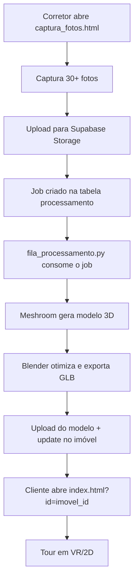

# 📖 Explicação do Código - Project Imob

Walkthrough do código fonte. Para status de implementação, veja [STATUS.md](STATUS.md). Para funcionalidades futuras, veja [ROADMAP.md](ROADMAP.md).

---

## Fluxo principal

```
📸 Captura → 🔄 Processamento → ☁️ Armazenamento → 🌐 Visualização → 👓 VR
```

---

## 1. Frontend — `frontend/index.html`

### Interface do usuário
```html
<div id="ui">
  <h1>🏠 Tour Virtual</h1>
  <p><strong>Imóvel:</strong> <span id="tituloImovel">Carregando...</span></p>
  <div id="loading">...</div>
  <div id="error">...</div>
</div>
```

### Cena 3D (A-Frame)
```html
<a-scene vr-mode-ui="enabled: true">
  <a-assets>
    <a-asset-item id="imovel" src="./assets/modelo.glb"></a-asset-item>
  </a-assets>
  <a-entity light="type: ambient; color: #BBB"></a-entity>
  <a-entity gltf-model="#imovel"></a-entity>
  <a-entity id="rig" position="0 1.6 0">
    <a-camera look-controls wasd-controls></a-camera>
  </a-entity>
</a-scene>
```

### Lógica JavaScript
```javascript
// Carrega dados do imóvel do Supabase
async function carregarImovel() {
  const { data: imovel, error } = await supabase
    .from('imoveis')
    .select('*')
    .eq('id', imovelId)
    .single();
  if (imovel.url_modelo_3d) carregarModelo(imovel.url_modelo_3d);
}

// Tratamento de erro visível ao usuário
function mostrarErro(mensagem) {
  errorEl.style.display = 'block';
  errorMsgEl.textContent = mensagem;
}
```

### Otimização — `frontend/otimizacao.js`
- **LOD**: 4 níveis de qualidade por distância (1.0 → 0.1)
- **Cache**: até 100MB de modelos em memória
- **Lazy loading**: carrega modelo sob demanda
- **Fallback**: se o otimizador falhar, usa `a-asset-item` padrão

> ⚠️ Detalhe conhecido: `const supabase = supabase.createClient(...)` sombreia o identificador global do SDK. Renomear para `supabaseClient` e garantir que o script do Supabase seja carregado antes.

---

## 2. Backend — `backend/schema.sql`

### Tabelas principais

**imoveis** — dados do imóvel e referência ao modelo:
```sql
create table imoveis (
  id uuid primary key,
  imobiliaria_id uuid references imobiliarias(id),
  titulo text not null,
  tipo text check (tipo in ('casa','apartamento','terreno','comercial')),
  url_modelo_3d text,
  status text default 'processando',
  hash_modelo text,
  deleted_at timestamp,
  created_at timestamp default now()
);
```

**processamento** — fila de jobs consumida por `fila_processamento.py`:
```sql
create table processamento (
  id uuid primary key,
  imovel_id uuid references imoveis(id),
  tipo text check (tipo in ('fotos','modelo_3d','tour_360')),
  status text check (status in ('pendente','processando','concluido','erro')),
  progresso integer default 0,
  tentativas integer default 0,
  max_tentativas integer default 3
);
```

**logs** — auditoria de ações com nível, dados anteriores/novos e usuário.

### Segurança
- **RLS** isola dados por imobiliária
- Edge Function valida JWT antes de usar a service-role key

> ⚠️ O modelo atual assume `auth.uid() = imobiliarias.id`. Para múltiplos usuários por imobiliária, criar tabela de membros.

---

## 3. Edge Function — `backend/edge_functions/upload_modelo.ts`

Fluxo de upload de modelo 3D com validações:

1. Verifica header `Authorization` → 401 se ausente
2. Valida token via `supabaseClient.auth.getUser(token)` → 401 se inválido
3. Valida extensão (`.glb`, `.gltf`) e tamanho (máx. 50MB) → 400
4. Confirma que o imóvel pertence à imobiliária do usuário → 403
5. Sanitiza nome do arquivo e faz upload para `modelos3d`
6. Gera hash SHA-256 e atualiza o registro do imóvel
7. Registra log de auditoria

---

## 4. Processamento — `scripts/processar_fotos.py`

### Funções principais

```python
def validar_fotos(fotos_dir: str) -> List[Path]:
    """Exige mínimo de fotos para reconstrução 3D"""
    # Busca .jpg/.jpeg/.png/.tiff/.bmp, retorna [] se < 20

def processar_meshroom_automatico(fotos_dir, output_dir):
    """Roda Meshroom via CLI com timeout de 30min"""
    cmd = [MESHROOM_PATH, "--input", fotos_dir,
           "--output", str(output_dir), "--forceCompute"]
    subprocess.run(cmd, check=True, timeout=1800)

def otimizar_blender(modelo_input, modelo_output):
    """Decimate em 3 níveis + exportação GLB com Draco"""
    # ratio: 0.9 → 0.7 → 0.5

def upload_supabase(arquivo_glb, imovel_id):
    """Upload para bucket modelos3d + update no registro"""
```

### Configuração
- `MESHROOM_PATH` e `BLENDER_PATH` via variáveis de ambiente
- Logs em `processamento.log` (arquivo + console)

---

## 5. Fila — `scripts/fila_processamento.py`

Worker que consome a tabela `processamento`:

1. Busca jobs com `status = 'pendente'`
2. Marca como `processando` e executa `processar_fotos.py`
3. Atualiza `progresso` e `status`
4. Em erro: incrementa `tentativas` até `max_tentativas`
5. Configuração em `scripts/config_fila.json`

> ⚠️ Para múltiplos workers concorrentes, o claiming do job deve ser atômico (ex: `UPDATE ... WHERE status='pendente' RETURNING`) — verificar antes de escalar.

---

## 6. Captura — `scripts/captura_fotos.html`

- Acessa câmera via `getUserMedia` (preferindo câmera traseira)
- Grid de sobreposição para orientar a captura
- Mínimo sugerido: 30 fotos (ideal: 50-80)
- Cada foto é enviada ao bucket `fotos-captura` e registrada em `fotos_captura`
- Alternativa: baixar ZIP local via JSZip

---

## Fluxo completo



---

**Dúvidas sobre pontos específicos?** Consulte [STATUS.md](STATUS.md) para o que está funcional ou abra uma issue no GitHub.
