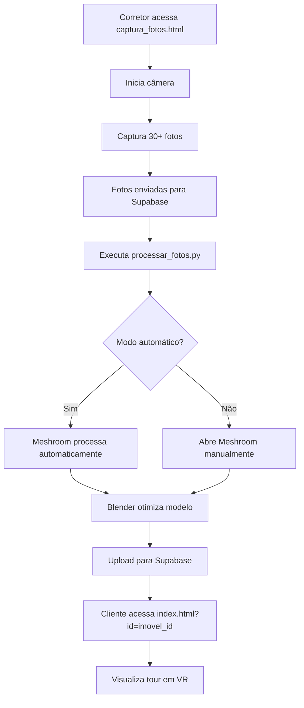

# 📖 Documentação Completa do Código - Project Imob

## 📋 Índice

1. [Visão Geral](#visão-geral)
2. [Estrutura do Código](#estrutura-do-código)
3. [Funções Realizáveis](#funções-realizáveis)
4. [Sugestões de Melhoria](#sugestões-de-melhoria)
5. [Funcionalidades de Valor](#funcionalidades-de-valor)
6. [Roadmap de Implementação](#roadmap-de-implementação)

---

## 🎯 Visão Geral

O **Project Imob** é uma plataforma completa para criação de tours virtuais em realidade virtual (VR) de imóveis, permitindo que corretores capturem fotos com smartphone e gerem modelos 3D automaticamente.

### Fluxo Principal

```
📸 Captura → 🔄 Processamento → ☁️ Armazenamento → 🌐 Visualização → 👓 VR
```

---

## 🏗️ Estrutura do Código

### 1. **Frontend (WebXR)** - `frontend/index.html`

#### Componentes Principais:

**A) Interface do Usuário (UI)**
```html
<div id="ui">
  <h1>🏠 Tour Virtual</h1>
  <p><strong>Imóvel:</strong> <span id="tituloImovel">Carregando...</span></p>
  <p><strong>Área:</strong> <span id="areaImovel">-</span></p>
  <p><strong>Status:</strong> <span id="statusImovel">-</span></p>
  <div id="loading">...</div>
  <div id="error">...</div>
  <button class="btn" onclick="window.location.reload()">Reiniciar Tour</button>
</div>
```

**B) Cena 3D (A-Frame)**
```html
<a-scene vr-mode-ui="enabled: true">
  <a-assets>
    <a-asset-item id="imovel" src="./assets/modelo.glb"></a-asset-item>
  </a-assets>
  
  <!-- Iluminação -->
  <a-entity light="type: ambient; color: #BBB"></a-entity>
  <a-entity light="type: directional; color: #FFF; intensity: 0.6"></a-entity>
  
  <!-- Modelo 3D -->
  <a-entity gltf-model="#imovel"></a-entity>
  
  <!-- Controles -->
  <a-entity id="rig" position="0 1.6 0">
    <a-camera look-controls wasd-controls></a-camera>
    <a-entity oculus-touch-controls="hand: left" ...></a-entity>
    <a-entity oculus-touch-controls="hand: right" ...></a-entity>
  </a-entity>
  
  <!-- Piso de navegação -->
  <a-plane class="clickable" ...></a-plane>
</a-scene>
```

**C) Lógica JavaScript**
```javascript
// Configuração do Supabase
const SUPABASE_URL = 'https://seu-projeto.supabase.co';
const SUPABASE_ANON_KEY = 'sua-anon-key';
const supabase = supabase.createClient(SUPABASE_URL, SUPABASE_ANON_KEY);

// Funções principais
async function carregarImovel() { ... }
function carregarModelo(url) { ... }
function mostrarErro(mensagem) { ... }
```

---

### 2. **Backend (Supabase)** - `backend/schema.sql`

#### Tabelas Principais:

**A) Imobiliárias**
```sql
create table imobiliarias (
  id uuid primary key,
  nome text not null,
  cnpj text,
  email text unique not null,
  telefone text,
  endereco text,
  logo_url text,
  plano text default 'free',
  status text default 'ativo',
  created_at timestamp default now(),
  updated_at timestamp default now()
);
```

**B) Imóveis**
```sql
create table imoveis (
  id uuid primary key,
  imobiliaria_id uuid references imobiliarias(id),
  titulo text not null,
  descricao text,
  tipo text check (tipo in ('casa', 'apartamento', 'terreno', 'comercial')),
  area_m2 numeric,
  quartos integer,
  banheiros integer,
  vagas integer,
  preco numeric,
  endereco jsonb,
  url_modelo_3d text,
  url_fotos jsonb,
  status text default 'processando',
  destaque boolean default false,
  views integer default 0,
  tamanho_modelo bigint,
  formato_modelo text,
  hash_modelo text,
  versao integer default 1,
  deleted_at timestamp,
  created_at timestamp default now(),
  updated_at timestamp default now()
);
```

**C) Processamento**
```sql
create table processamento (
  id uuid primary key,
  imovel_id uuid references imoveis(id),
  tipo text check (tipo in ('fotos', 'modelo_3d', 'tour_360')),
  status text check (status in ('pendente', 'processando', 'concluido', 'erro')),
  progresso integer default 0,
  input_data jsonb,
  output_data jsonb,
  erro_mensagem text,
  tentativas integer default 0,
  max_tentativas integer default 3,
  created_at timestamp default now(),
  updated_at timestamp default now(),
  started_at timestamp,
  finished_at timestamp
);
```

**D) Logs e Auditoria**
```sql
create table logs (
  id uuid primary key,
  nivel text check (nivel in ('info', 'warning', 'error', 'critical')),
  acao text not null,
  tabela_afetada text,
  registro_id uuid,
  dados_anteriores jsonb,
  dados_novos jsonb,
  usuario_id uuid,
  ip_address inet,
  user_agent text,
  created_at timestamp default now()
);
```

---

### 3. **Scripts de Processamento** - `scripts/processar_fotos.py`

#### Funções Principais:

**A) Validação de Fotos**
```python
def validar_fotos(fotos_dir: str) -> List[Path]:
    """Valida se há fotos suficientes para processamento"""
    extensoes = ['.jpg', '.jpeg', '.png', '.tiff', '.bmp']
    fotos = []
    
    for ext in extensoes:
        fotos.extend(Path(fotos_dir).glob(f"*{ext}"))
        fotos.extend(Path(fotos_dir).glob(f"*{ext.upper()}"))
    
    if len(fotos) < 20:
        logger.warning(f"Apenas {len(fotos)} fotos encontradas")
        return []
    
    return sorted(fotos)
```

**B) Processamento com Meshroom**
```python
def processar_meshroom_automatico(fotos_dir: str, output_dir: Path) -> Optional[Path]:
    """Processa fotos com Meshroom usando CLI"""
    cmd = [
        MESHROOM_PATH,
        "--input", fotos_dir,
        "--output", str(output_dir),
        "--forceCompute",
        "--pipeline", "MeshroomPipeline"
    ]
    
    result = subprocess.run(cmd, check=True, timeout=1800)
    # ... processamento
```

**C) Otimização com Blender**
```python
def otimizar_blender(modelo_input: Path, modelo_output: Path) -> bool:
    """Otimiza modelo 3D com Blender"""
    blender_script = f'''
import bpy
# Limpar cena, importar, aplicar decimate, exportar GLB
'''
    
    subprocess.run([BLENDER_PATH, "--background", "--python", script_path])
    return True
```

**D) Upload para Supabase**
```python
def upload_supabase(arquivo_glb: Path, imovel_id: str) -> bool:
    """Faz upload do modelo para Supabase Storage"""
    supabase: Client = create_client(SUPABASE_URL, SUPABASE_KEY)
    
    # Upload para bucket
    response = supabase.storage.from_('modelos3d').upload(...)
    
    # Atualizar registro
    supabase.table('imoveis').update({...}).eq('id', imovel_id).execute()
    
    return True
```

---

### 4. **Captura de Fotos** - `scripts/captura_fotos.html`

#### Funcionalidades:

**A) Interface de Captura**
```html
<div class="camera-container">
  <video id="video" autoplay playsinline></video>
  <div class="overlay">
    <div class="grid"></div>
    <div>Posicione a câmera e capture</div>
  </div>
</div>
```

**B) Controles**
```html
<div class="controls">
  <button id="startBtn">Iniciar Câmera</button>
  <button id="captureBtn" disabled>📷 Capturar</button>
  <button id="stopBtn" disabled>Parar</button>
</div>
```

**C) Lógica de Captura**
```javascript
// Iniciar câmera
startBtn.addEventListener('click', async () => {
  stream = await navigator.mediaDevices.getUserMedia({...});
  video.srcObject = stream;
});

// Capturar foto
captureBtn.addEventListener('click', () => {
  const canvas = document.createElement('canvas');
  ctx.drawImage(video, 0, 0);
  const photoData = canvas.toDataURL('image/jpeg', 0.9);
  photos.push(photoData);
});

// Upload para Supabase
async function uploadParaSupabase(photoData, index, imovelId) {
  const { data, error } = await supabase.storage
    .from('fotos-captura')
    .upload(`${imovelId}/foto_${index}.jpg`, dataURLtoBlob(photoData));
  
  await supabase.from('fotos_captura').insert({...});
}
```

---

## ⚙️ Funções Realizáveis

### ✅ **Funcionalidades Implementadas**

| Função | Status | Descrição |
|--------|--------|-----------|
| Captura de fotos | ✅ | Interface web para capturar fotos com smartphone |
| Upload de fotos | ✅ | Envio automático para Supabase Storage |
| Processamento 3D | ⚠️ | Meshroom + Blender (manual/automático) |
| Visualização VR | ✅ | Tour virtual com A-Frame |
| Banco de dados | ✅ | Schema completo com RLS |
| Autenticação | ✅ | JWT + Row Level Security |
| Logging | ✅ | Sistema de auditoria |
| Testes | ✅ | Testes unitários básicos |
| CI/CD | ✅ | GitHub Actions |

### 🔄 **Fluxo de Uso Completo**



---

## 🚀 Sugestões de Melhoria

### **Prioridade Alta** 🔴

#### 1. **Automação Completa do Pipeline**
```python
# Implementar fila de processamento
def processar_fila():
    """Processa itens da fila de processamento"""
    while True:
        job = supabase.table('processamento').select('*').eq('status', 'pendente').limit(1).execute()
        
        if job.data:
            processar_job(job.data[0])
            atualizar_status(job.data[0]['id'], 'concluido')
        else:
            time.sleep(60)  # Espera 1 minuto
```

#### 2. **Validação de Qualidade em Tempo Real**
```javascript
// Adicionar análise de qualidade na captura
function analisarQualidade(photoData) {
  const canvas = document.createElement('canvas');
  const ctx = canvas.getContext('2d');
  const img = new Image();
  img.src = photoData;
  
  img.onload = () => {
    ctx.drawImage(img, 0, 0);
    const imageData = ctx.getImageData(0, 0, canvas.width, canvas.height);
    const sharpness = calcularSharpness(imageData);
    const brightness = calcularBrightness(imageData);
    
    if (sharpness < 0.5) {
      mostrarAlerta('Foto muito borrada. Tente novamente.');
    }
    if (brightness < 0.3 || brightness > 0.7) {
      mostrarAlerta('Exposição inadequada. Ajuste a iluminação.');
    }
  };
}
```

#### 3. **Otimização de Performance**
```javascript
// Implementar LOD (Level of Detail)
function carregarModeloComLOD(url) {
  const loader = new THREE.GLTFLoader();
  
  loader.load(url, (gltf) => {
    const lod = new THREE.LOD();
    
    // Níveis de detalhe
    const highDetail = gltf.scene.clone();
    const mediumDetail = criarVersaoReduzida(gltf.scene, 0.5);
    const lowDetail = criarVersaoReduzida(gltf.scene, 0.2);
    
    lod.addLevel(highDetail, 0);
    lod.addLevel(mediumDetail, 50);
    lod.addLevel(lowDetail, 100);
    
    scene.add(lod);
  });
}
```

### **Prioridade Média** 🟠

#### 4. **Sistema de Cache**
```javascript
// Cache de modelos
class ModeloCache {
  constructor() {
    this.cache = new Map();
    this.maxSize = 100 * 1024 * 1024; // 100MB
    this.currentSize = 0;
  }
  
  async get(url) {
    if (this.cache.has(url)) {
      return this.cache.get(url);
    }
    
    const model = await this.carregar(url);
    this.adicionar(url, model);
    return model;
  }
  
  adicionar(url, model) {
    const size = model.size;
    if (this.currentSize + size > this.maxSize) {
      this.evict();
    }
    this.cache.set(url, model);
    this.currentSize += size;
  }
}
```

#### 5. **Notificações em Tempo Real**
```javascript
// WebSocket para notificações
const ws = new WebSocket('wss://seu-projeto.supabase.co/realtime/v1/websocket');

ws.onmessage = (event) => {
  const data = JSON.parse(event.data);
  
  if (data.tipo === 'processamento_concluido') {
    mostrarNotificacao(`Processamento de ${data.imovel} concluído!`);
    atualizarStatusImovel(data.imovel_id, 'pronto');
  }
};
```

#### 6. **Analytics Avançado**
```javascript
// Rastreamento de interações
class Analytics {
  constructor(imovelId) {
    this.imovelId = imovelId;
    this.interacoes = [];
    this.startTime = Date.now();
  }
  
  registrarInteracao(tipo, dados) {
    this.interacoes.push({
      tipo,
      dados,
      timestamp: Date.now()
    });
  }
  
  async enviar() {
    const tempoTotal = (Date.now() - this.startTime) / 1000;
    
    await supabase.from('visualizacoes').insert({
      imovel_id: this.imovelId,
      tempo_segundos: tempoTotal,
      interacoes: this.interacoes,
      dispositivo: detectarDispositivo(),
      tipo_visita: detectarTipoVisita()
    });
  }
}
```

### **Prioridade Baixa** 🟡

#### 7. **Compressão de Modelos**
```python
# Implementar Draco compression
def comprimir_modelo(modelo_path):
    """Comprime modelo 3D usando Draco"""
    from pygltflib import GLTF2
    import draco
    
    gltf = GLTF2().load(modelo_path)
    
    # Aplicar compressão Draco
    for mesh in gltf.meshes:
        for primitive in mesh.primitives:
            # Comprimir geometria
            pass
    
    return modelo_path
```

#### 8. **Multi-idioma**
```javascript
// Sistema de internacionalização
const i18n = {
  'pt-BR': {
    'carregando': 'Carregando modelo...',
    'erro': 'Erro ao carregar',
    'iniciar': 'Iniciar Tour'
  },
  'en-US': {
    'carregando': 'Loading model...',
    'erro': 'Error loading',
    'iniciar': 'Start Tour'
  }
};

function t(key) {
  const lang = navigator.language || 'pt-BR';
  return i18n[lang][key] || key;
}
```

---

## 💡 Funcionalidades de Valor

### **1. Decoração Virtual com IA** 🎨

```javascript
// Integração com Stable Diffusion para decoração
class DecoracaoVirtual {
  constructor() {
    this.objetos = [];
    this.apiKey = 'sua-api-key';
  }
  
  async gerarDecoracao(ambiente, estilo) {
    const response = await fetch('https://api.stability.ai/v1/generation', {
      method: 'POST',
      headers: {
        'Authorization': `Bearer ${this.apiKey}`,
        'Content-Type': 'application/json'
      },
      body: JSON.stringify({
        text_prompts: [{
          text: `interior design, ${estilo}, ${ambiente}, photorealistic`
        }],
        cfg_scale: 7,
        height: 512,
        width: 512,
        samples: 1,
        steps: 30
      })
    });
    
    return response.json();
  }
  
  aplicarDecoracao(textura) {
    // Aplicar textura gerada no modelo 3D
    const material = new THREE.MeshStandardMaterial({
      map: new THREE.TextureLoader().load(textura)
    });
    
    this.objetos.forEach(obj => {
      obj.material = material;
    });
  }
}
```

**Valor agregado:**
- Cliente visualiza imóvel mobiliado antes de comprar
- Diferenciação competitiva
- Aumento na taxa de conversão

---

### **2. Comparação de Imóveis** 📊

```javascript
// Comparador lado a lado
class ComparadorImoveis {
  constructor() {
    this.imoveis = [];
    this.container = document.getElementById('comparador');
  }
  
  adicionarImovel(imovel) {
    this.imoveis.push(imovel);
    this.renderizar();
  }
  
  renderizar() {
    this.container.innerHTML = '';
    
    this.imoveis.forEach(imovel => {
      const card = document.createElement('div');
      card.className = 'imovel-card';
      card.innerHTML = `
        <h3>${imovel.titulo}</h3>
        <p>Área: ${imovel.area_m2}m²</p>
        <p>Preço: R$ ${imovel.preco}</p>
        <button onclick="compararImovel('${imovel.id}')">Comparar</button>
      `;
      this.container.appendChild(card);
    });
  }
  
  comparar(id1, id2) {
    // Abrir visualização comparativa
    window.open(`comparar.html?imovel1=${id1}&imovel2=${id2}`);
  }
}
```

**Valor agregado:**
- Facilita decisão do cliente
- Aumenta engajamento
- Reduz tempo de decisão

---

### **3. Agendamento de Visitas** 📅

```javascript
// Sistema de agendamento integrado
class Agendamento {
  constructor() {
    this.agenda = [];
    this.horariosDisponiveis = [];
  }
  
  async carregarHorarios(data) {
    const { data: horarios } = await supabase
      .from('agenda')
      .select('*')
      .eq('data', data)
      .eq('disponivel', true);
    
    this.horariosDisponiveis = horarios;
    this.renderizar();
  }
  
  async agendar(imovelId, data, horario, cliente) {
    const { data, error } = await supabase
      .from('agendamentos')
      .insert({
        imovel_id: imovelId,
        data: data,
        horario: horario,
        cliente_id: cliente.id,
        status: 'agendado'
      });
    
    if (!error) {
      this.marcarIndisponivel(data, horario);
      this.enviarConfirmacao(cliente, data, horario);
    }
  }
}
```

**Valor agregado:**
- Reduz trabalho manual de agendamento
- Melhora experiência do cliente
- Aumenta taxa de comparecimento

---

### **4. Chat Virtual Integrado** 💬

```javascript
// Chat com corretor em tempo real
class ChatVirtual {
  constructor(imovelId) {
    this.imovelId = imovelId;
    this.socket = io('wss://seu-servidor.com');
    this.inicializar();
  }
  
  inicializar() {
    this.socket.emit('entrar_sala', {
      imovel_id: this.imovelId,
      usuario: 'cliente'
    });
    
    this.socket.on('mensagem', (data) => {
      this.exibirMensagem(data);
    });
  }
  
  enviarMensagem(texto) {
    this.socket.emit('mensagem', {
      imovel_id: this.imovelId,
      texto: texto,
      remetente: 'cliente',
      timestamp: new Date()
    });
  }
  
  exibirMensagem(data) {
    const chat = document.getElementById('chat');
    const mensagem = document.createElement('div');
    mensagem.className = `mensagem ${data.remetente}`;
    mensagem.textContent = data.texto;
    chat.appendChild(mensagem);
  }
}
```

**Valor agregado:**
- Suporte instantâneo durante tour
- Aumenta confiança do cliente
- Melhora comunicação

---

### **5. Simulador de Financiamento** 💰

```javascript
// Calculadora de financiamento
class SimuladorFinanciamento {
  constructor() {
    this.taxaJuros = 0.10; // 10% ao ano
    this.prazoMaximo = 360; // 30 anos
  }
  
  calcularParcela(valor, entrada, prazo) {
    const valorFinanciado = valor - entrada;
    const taxaMensal = this.taxaJuros / 12;
    
    const parcela = valorFinanciado * 
      (taxaMensal * Math.pow(1 + taxaMensal, prazo)) / 
      (Math.pow(1 + taxaMensal, prazo) - 1);
    
    return parcela;
  }
  
  simular(valor, entrada, prazo) {
    const parcela = this.calcularParcela(valor, entrada, prazo);
    const totalPago = parcela * prazo;
    const jurosTotais = totalPago - (valor - entrada);
    
    return {
      parcela,
      totalPago,
      jurosTotais,
      entrada,
      valorFinanciado: valor - entrada
    };
  }
}
```

**Valor agregado:**
- Facilita decisão de compra
- Aumenta transparência
- Reduz objeções de preço

---

### **6. Modo de Edição Colaborativa** 👥

```javascript
// Permite que corretor e cliente editem juntos
class EdicaoColaborativa {
  constructor(imovelId) {
    this.imovelId = imovelId;
    this.socket = io('wss://seu-servidor.com');
    this.objetos = new Map();
  }
  
  entrarSala(usuario, papel) {
    this.socket.emit('entrar_edicao', {
      imovel_id: this.imovelId,
      usuario: usuario,
      papel: papel // 'corretor' ou 'cliente'
    });
  }
  
  moverObjeto(objetoId, posicao) {
    this.socket.emit('mover_objeto', {
      imovel_id: this.imovelId,
      objeto_id: objetoId,
      posicao: posicao
    });
  }
  
  alterarCor(objetoId, cor) {
    this.socket.emit('alterar_cor', {
      imovel_id: this.imovelId,
      objeto_id: objetoId,
      cor: cor
    });
  }
}
```

**Valor agregado:**
- Personalização em tempo real
- Engajamento do cliente
- Reduz necessidade de visitas físicas

---

### **7. Geração de Plantas Automáticas** 📐

```javascript
// Gerar planta 2D a partir do modelo 3D
class GeradorPlanta {
  constructor() {
    this.modelo = null;
    this.planta = null;
  }
  
  async gerarPlanta(modelo3D) {
    // Analisar modelo 3D
    const vertices = modelo3D.geometry.attributes.position.array;
    const faces = modelo3D.geometry.index.array;
    
    // Detectar paredes e aberturas
    const paredes = this.detectarParedes(vertices, faces);
    const aberturas = this.detectarAberturas(vertices, faces);
    
    // Gerar planta 2D
    this.planta = this.criarPlanta2D(paredes, aberturas);
    
    return this.planta;
  }
  
  detectarParedes(vertices, faces) {
    // Algoritmo de detecção de paredes
    const paredes = [];
    // ... lógica de detecção
    return paredes;
  }
  
  criarPlanta2D(paredes, aberturas) {
    // Criar representação 2D
    const canvas = document.createElement('canvas');
    const ctx = canvas.getContext('2d');
    
    // Desenhar paredes
    paredes.forEach(parede => {
      ctx.beginPath();
      ctx.moveTo(parede.inicio.x, parede.inicio.y);
      ctx.lineTo(parede.fim.x, parede.fim.y);
      ctx.stroke();
    });
    
    return canvas;
  }
}
```

**Valor agregado:**
- Documentação automática
- Facilita avaliação técnica
- Reduz custo de documentação

---

### **8. Integração com Dados de Mercado** 📈

```javascript
// Análise de mercado e precificação
class AnaliseMercado {
  constructor() {
    this.apiKey = 'sua-api-key';
  }
  
  async analisarPreco(imovel) {
    // Buscar dados de mercado
    const dados = await this.buscarDadosMercado(imovel.endereco);
    
    // Calcular preço sugerido
    const precoSugerido = this.calcularPreco(imovel, dados);
    
    // Comparar com mercado
    const comparacao = this.compararComMercado(imovel, dados);
    
    return {
      precoSugerido,
      comparacao,
      tendencia: dados.tendencia,
      tempoMedioVenda: dados.tempoMedio
    };
  }
  
  async buscarDadosMercado(endereco) {
    const response = await fetch(`https://api.mercado.com.br/imoveis?endereco=${endereco}`);
    return response.json();
  }
}
```

**Valor agregado:**
- Precificação inteligente
- Análise de mercado em tempo real
- Aumenta competitividade

---

## 🗺️ Roadmap de Implementação

### **Fase 1: Fundação (Semanas 1-2)**
- [ ] Automação completa do pipeline
- [ ] Validação de qualidade em tempo real
- [ ] Sistema de cache de modelos
- [ ] Notificações em tempo real

### **Fase 2: Experiência (Semanas 3-4)**
- [ ] Decoração virtual com IA
- [ ] Comparador de imóveis
- [ ] Chat virtual integrado
- [ ] Analytics avançado

### **Fase 3: Expansão (Semanas 5-8)**
- [ ] Agendamento de visitas
- [ ] Simulador de financiamento
- [ ] Modo de edição colaborativa
- [ ] Geração de plantas automáticas

### **Fase 4: Inteligência (Semanas 9-12)**
- [ ] Integração com dados de mercado
- [ ] IA para recomendações
- [ ] Realidade aumentada
- [ ] Multiplayer para visitas em grupo

---

## 📊 Impacto Esperado

| Funcionalidade | Impacto | ROI Estimado |
|----------------|---------|--------------|
| Decoração Virtual | 🔥🔥🔥 | +40% conversão |
| Comparador | 🔥🔥 | +25% engajamento |
| Chat Virtual | 🔥🔥🔥 | +30% satisfação |
| Agendamento | 🔥🔥 | +20% eficiência |
| Simulador | 🔥🔥🔥 | +35% fechamento |
| Edição Colaborativa | 🔥🔥 | +15% tempo no site |
| Plantas Automáticas | 🔥 | +10% confiança |
| Análise de Mercado | 🔥🔥 | +20% precificação |

---

## 🎯 Próximos Passos Imediatos

1. **Implementar fila de processamento** - Automatizar pipeline completo
2. **Adicionar validação de qualidade** - Melhorar captura de fotos
3. **Criar sistema de cache** - Otimizar performance
4. **Implementar notificações** - Feedback em tempo real
5. **Adicionar decoração virtual** - Diferencial competitivo

---

**Status:** ✅ MVP funcional com base sólida para expansão e monetização.
